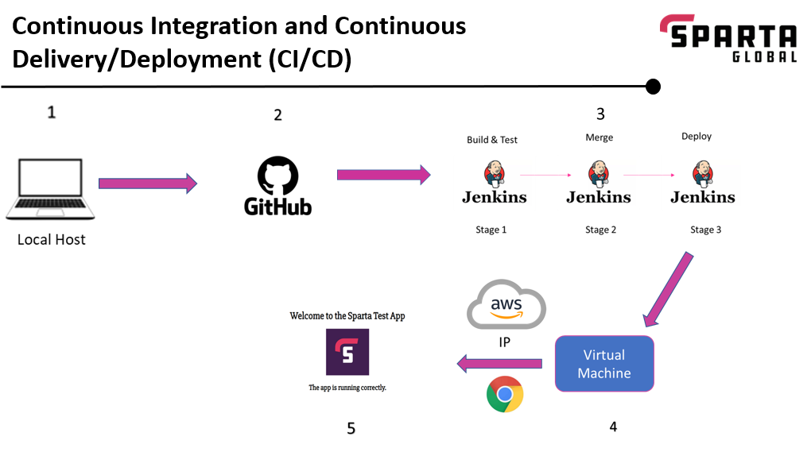
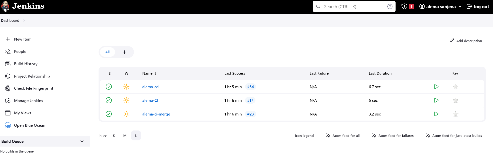
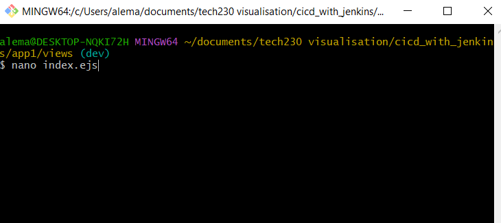
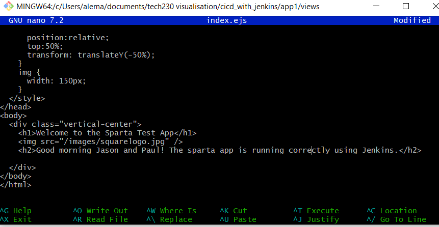
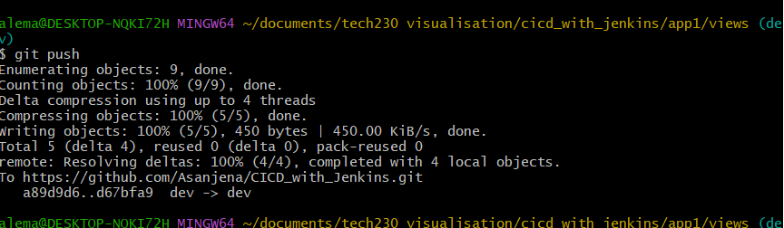
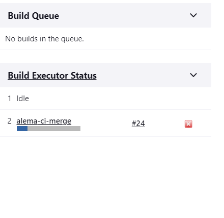
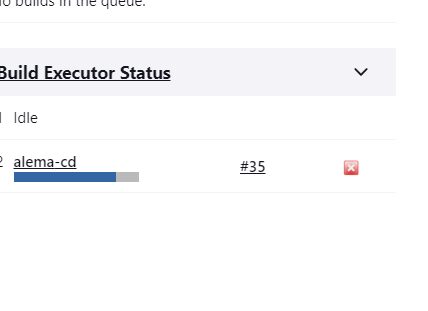
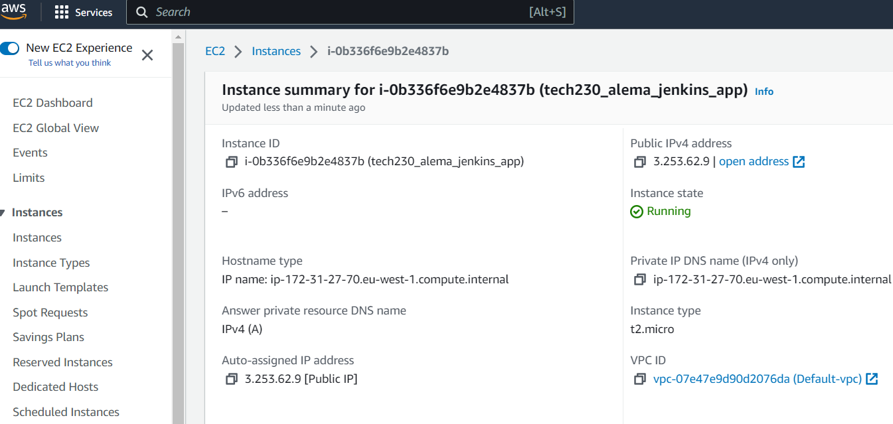
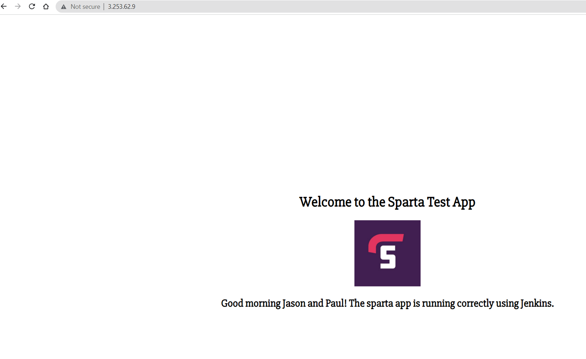

# Building a CI/CD pipeline using Jenkins

***

The aim of this project was to create a pipeline to streamline the process of making a change to the Sparta Test app display page. 

***
## **Step 1 - Setting up Jenkins**

The first step was to create a jenkins server and set up 3 jobs on there. The role of the 3 jobs are as follows:

**Job 1:** To build and test the app code changes that are made. If there tests fail, I can use the feedback to ammend the code. I the tests pass, it should trigger:

**Job 2:** This will then merge the successfully tested code changes from the development branch to the main branch (that has the working app code). This will then trigger:

**Job 3** The updated code will be sent to the production environment (in this case, an instance on AWS)

***
## **Step 2 - Making a change**

After setting up Jenkins, I then proceeded to setting up a development environment and made a change in the html file for the sparta test app. 

  

I then pushed these changes to my repository on Github. This repository is linked to my Jenkins and I also set up a webhook so that anytime a change is made and pushed to my repository, my Jenkins server is notified. This will then automatically triggger the pipeline. 

As you can see from the images, the different jobs were automatically triggered the moment I pushed my new code.

  

***

## **Step 3 - Checking if the deployment was successful**

Once the 3 jobs have been successful, I then grabbed the IP adress from my AWS instance and put this in a web browser to see of the changes were successfully deployed.

As you can see, the deployment was successful and I now have a pipeline that makes the process of making a change to the display page quick and efficient!
