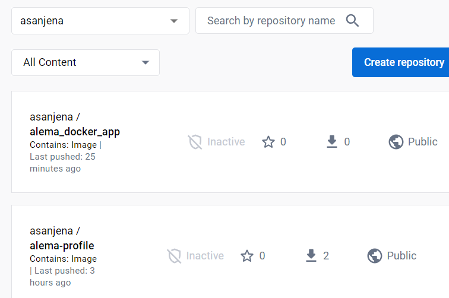
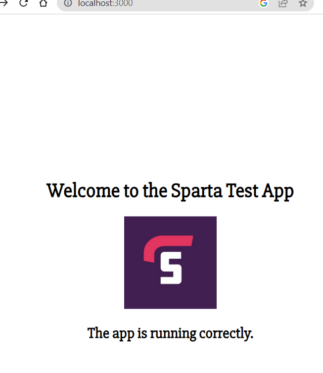
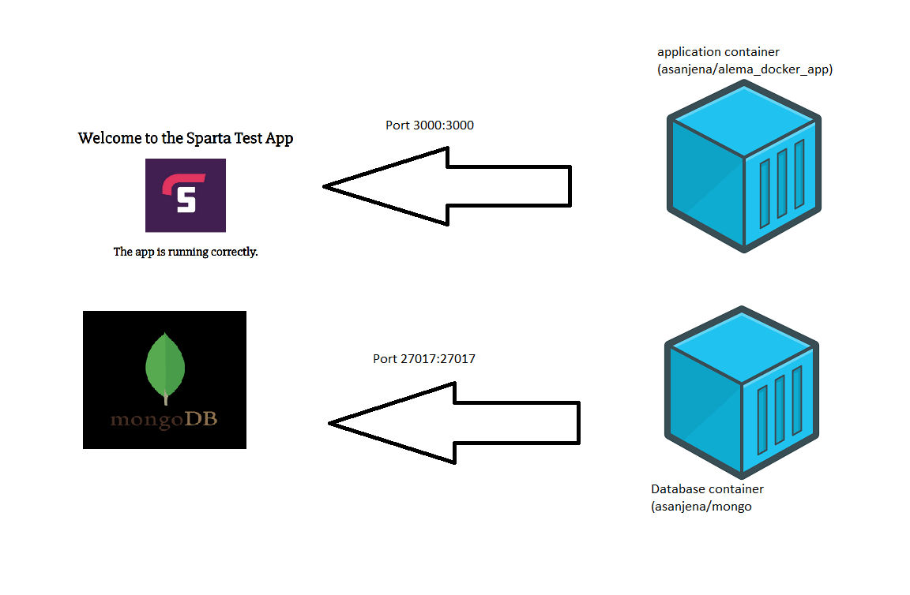
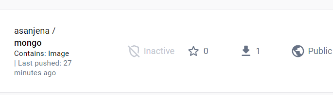
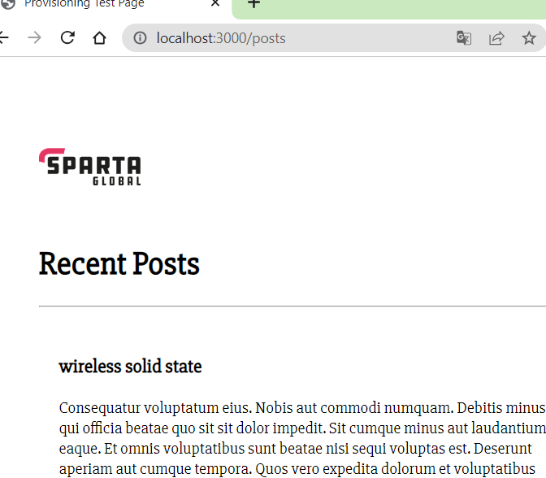

# Docker
 
This will go through how you can make images on Docker and use these to run containers for Nginx and the Nodejs web app. 


# Hosting a static website with Nginx web-server

1. Use the **docker run** command to run the official NGinx image. When you use this command, it will kick in an API and check if there is an image locally. If not, then it will go to docker hub and pull it down from there.

2. To set up the nginx web-server, use command:

Docker run -d -p 80:80 nginx

(if you don't have it locally, it will pull from docker hub)

3. In web browser, type 'localhost', and you will be able to see the nginx welcome page.


## Interacting with running container**
1. To log into the running container, and cofigure nginx, run the command:

```
docker exec -it <container id> sh
```

2. If you get a windown related error, try: 

```
alias docker = 'winpty docker", and run the command from 1. again
```

3. Once inside, use the following commands so that we can edit index.html:

```
apt update -y
apt upgrade -y
apt install sudo -y
sudo apt install nano -y

cd /user/share/nginx/html
```

5. Then run 'exit'

## Hosting own profile website on nginx server

1. On vscode, create an index.html and add in your profile contents

2. Due to issues with git bash, I opened up command promt. cd into the right directory (where the index.html is), and then copy the profile (index.html) to /usr/share/nginx/html

```
docker cp index.html 907263cab327:/usr/share/nginx/html/
```

**note**: 907263cab327 is the container name


## Images and using Dockerfile

1. We can make a Dockerfile that has commands to execute when making an image:

```
sudo nano Dockerfile
```
2. Add the following to the Dockerfile:
```
# Use official Nginx image as base image
FROM nginx

# Label it with your name
LABEL MAINTAINER=ALEMA@SPARTA

# Copy index.html to container Nginx html folder
COPY index.html /usr/share/nginx/html/

# Expose Port 80 on container
EXPOSE 80

# Launch the app/server
CMD ["nginx", "-g", "daemon off;"]
```

## Configuring Dockerfile to build and image and run Nodejs:

1. In the Dockerfile, use the following:
```
# Use official Node image as base image
FROM node

# Label it with your name
LABEL MAINTAINER=ALEMA@SPARTA

# Create and navigate to app folder
WORKDIR /usr/src/app

# Copy app folder contents to container app folder
COPY app /usr/src/app

# Expose Port 3000 on container
EXPOSE 3000

# Launch the app/server
CMD ["node", "app.js"]
```
2. Build the image using the command:
```
docker build -t asanjena/alema_docker_app .
```

3. Push it using:
```
docker push asanjena/alema_docker_app

```

4. Run it using:
```
docker run -d -p 3000:3000 asanjena/alema_docker_app
```



5. You should then be able to access 'localhost:3000' and 'localhost:3000/fibonacci/10' in a web browser




## Database with Docker

1. Go to Docker hub and pull the official mongo image from there using the command:

```
docker pull mongo
```

2. Then run it using the command:

```
docker run -d -p 27017:27017 mongo
```
3. Sort any windows related issues:

```
alias docker "winpty docker"
```

4. Enter the container:

```
docker exec -it <container id> sh
```

5. Run any update commands and install sudo and nano:

```
apt update -y
apt upgrade -y
apt install sudo -y
sudo apt install nano -y
```

6. Next, we need to change the configuration. Use the command:

```
sudo nano mongod.conf.orig
```

in the editory, change the bind ip so that it is 0.0.0.0

Then 'exit'

7. We can then commit using:

```
docker commit 1e3c639e7e63 asanjena/database
```

**note:** 1e3c639e7e63 is the container id for this demo


8. To make the image available on docker hub, use the push command:

```
docker push asanjena/database
```

Now, anyone can use 'docker run -d -p 27017:27017 asanjena/database:latest'


If you now go to a webrowser and type localhost:27017, you should see a page saying "It looks like you are trying to access MongoDB over HTTP on the native driver port."


## Using Docker compose





This section will run through how I used the two images I have made to show the posts page for the Sparta app on port 3000/posts


As the mongo version that I was using previously did not work, I removed it and switched to version 4.4:

```
$ docker run -d -p 27017 mongo:4.4
```
I then commited and pushed this to make it available on docker hub:


```
$ docker commit 5d857a755f3b asanjena/mongo
$ docker push asanjena/mongo
```

1. Make sure you have stopped everything to free up the ports:

```
docker ps (to look at what containers are running)
docker rm <container id> -f
```

2. Create a docker-compose.yml file in the same directory as your Dockerfile. In the file, add your script:

```
version: '3.1'

 

services:
  database:
    image: asanjena/mongo
    restart: always
    ports:
      - 27017:27017

 

  sparta-app:
    image: asanjena/alema_docker_app
    restart: always
    ports:
      - 3000:3000
    depends_on:
      - database
    environment:
      - DB_HOST=database:27017/posts
    command: >
      sh -c "npm install && npm start"

```

In this, I have specified two services:

1) database: This service runs a MongoDB container based on the asanjena/mongo image I made. It has a restart policy of "always," which means the container will restart automatically if it stops unexpectedly. The service maps port 27017 from the host to the container, allowing external access to the MongoDB instance.

2) sparta-app: This service runs an application container based on the asanjena/alema_docker_app image I made. It also has a restart policy of "always." The service maps port 3000 from the host to the container, enabling external access to the application.

- The sparta-app service depends on the database service, as specified by the depends_on section. This ensures that the database service is started before the application service.

- The application container within the sparta-app service has an environment variable DB_HOST set to database:27017/posts. This configuration allows the application to connect to the MongoDB database using the hostname database and port 27017.

- When the container starts, it executes the command sh -c "npm install && npm start". This command installs the required dependencies using npm install and starts the application using npm start.


3. Next step is to enter:

```
docker-compose up -d
```

4. If you then navigate to your web browser and type 'http://localhost:3000/posts', you should be able to see the posts page (after a short delay)




