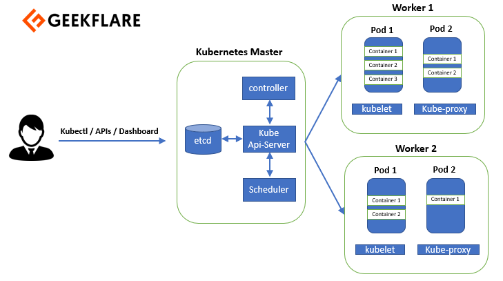

## Kubernetes (k8)

Kubernetes is an open-source container orchestration platform developed by Google. It provides a framework for automating the deployment, scaling, and management of containerised applications. With Kubernetes, you can easily manage clusters of containers and abstract away the underlying infrastructure complexities.

Kubernetes enables you to define and deploy your applications as sets of modular, loosely coupled services, known as microservices. It offers features like automated container placement, load balancing, and scaling, ensuring efficient resource utilization and high availability.

Kubernetes provides a declarative configuration approach, allowing you to define your desired state for applications and letting Kubernetes handle the actual deployment and maintenance. It also offers advanced capabilities such as rolling updates, service discovery, and self-healing, ensuring seamless application updates and high reliability.

 It ensures that your application runs reliably, scales efficiently, and can adapt to changing demands. In simple terms, Kubernetes is a tool that makes it easier to run and manage applications in a distributed computing environment.

### Why K8 should be used

Kubernetes should be used due to its ability to simplify and automate the deployment, scaling, and management of containerized applications. It provides a robust platform for orchestrating and coordinating containers, allowing for efficient resource utilisation, high availability, and seamless scaling. 

Kubernetes offers features like:

- service discovery
- load balancing
- self-healing
- rolling updates

These enhance application reliability and reducing downtime. 

It also supports a wide range of cloud providers and on-premises environments, ensuring portability and flexibility. 

By leveraging Kubernetes, organisations can streamline their development and operations and speed up application delivery.

### K8 Cluster

Kubernetes (K8s) cluster is a group of computers (servers or virtual machines) that work together to run and manage containerised applications using Kubernetes. Think of it as a team of computers collaborating to handle and organize containers effectively.

In a K8s cluster, there are two main types of machines: master nodes and worker nodes. The master nodes handle the overall management and coordination of the cluster, while the worker nodes are where the containers actually run.

1. The **master nodes** oversee tasks like scheduling containers, monitoring their health, and managing the cluster's overall state. They have components like the API server, scheduler, and controller manager.

2. The **worker nodes** execute the containers. They have a container runtime (like Docker) that runs the containers assigned to them. The worker nodes communicate with the master nodes to receive instructions and report the status of the containers they run.

Together, the master and worker nodes form a K8s cluster, creating a powerful and scalable platform for deploying and managing containerized applications. It allows you to easily scale your applications, handle high traffic, and ensure high availability. The cluster provides a consistent environment for running your applications, abstracting away the complexities of managing individual containers and allowing you to focus on developing and deploying your software

### K8 Objects
Kubernetes (K8s) object refers to a fundamental building block used to define and manage applications within a Kubernetes cluster. It represents a specific entity or resource required to run an application.

Kubernetes objects are defined using YAML or JSON configuration files. These objects define the desired state of the application, such as the number of replicas, container images, networking settings, resource requirements, and more. Once created, Kubernetes takes care of ensuring the actual state of the application matches the desired state defined in the object.

Some common examples of Kubernetes objects include:

Pod: Represents the smallest and simplest unit in Kubernetes. It encapsulates one or more containers and their shared resources.

Deployment: Defines the desired state of a set of Pods, including the number of replicas and the container image to be used. It manages the lifecycle of the Pods and handles updates and rollbacks.

Service: Provides a stable network endpoint for accessing a set of Pods. It allows other services or applications to communicate with the Pods using a consistent network address.

ConfigMap and Secret: Objects used to store configuration data and sensitive information, respectively. ConfigMaps store non-sensitive configuration data, while Secrets securely store sensitive data such as passwords or API keys.

These Kubernetes objects, along with others such as Ingress, PersistentVolume, and StatefulSet, help define and manage different aspects of your application within the Kubernetes cluster. They provide a declarative approach to describe the desired state of your application, and Kubernetes takes care of maintaining and managing the actual state to ensure your application runs reliably and efficiently.

### K8 Services 

a Service is an abstract way to expose an application running on a set of Pods as a network service. It provides a stable network endpoint that other applications or external users can connect to.

Key points about Kubernetes Services:

Load Balancing: A Service distributes network traffic evenly among the Pods associated with it. It acts as a load balancer, ensuring that requests are spread across the available Pods, promoting scalability and high availability.

Service Discovery: Services enable other applications within the cluster to discover and connect to them using a consistent and stable network address. This decouples the consumer of the service from the specific Pod instances backing it.

Cluster-Internal Communication: Services allow communication between different components and services within the Kubernetes cluster. By referencing a Service, applications can access the Pods behind it using the Service's name and assigned port.

Exposing Services Externally: Kubernetes provides various ways to expose Services externally. This includes creating NodePort Services that allocate a specific port on each cluster node, LoadBalancer Services that use cloud provider load balancers, or Ingress Controllers that allow routing traffic to Services based on defined rules.

Overall, Services in Kubernetes simplify network connectivity, load balancing, and service discovery within the cluster. They provide a stable and abstracted endpoint for applications, enabling seamless communication between different components and facilitating external access to the services running in the cluster.

### K8 Deployments

A Kubernetes Deployment tells Kubernetes how to create or modify instances of the pods that hold a containerised application. Deployments can help to efficiently scale the number of replica pods, enable the rollout of updated code in a controlled manner, or roll back to an earlier deployment version if necessary. Kubernetes deployments are completed using kubectl, the command-line tool that can be installed on various platforms

### Self-healing

enables software to autonomously resolve issues based on a desired state. Kubernetes' self-healing is built in, but it demands observation.

 If a container fails, Kubernetes automatically redeploys the afflicted container to its desired state to restore operations.

Self-healing Kubernetes has four capabilities:

restart failed containers;
replace containers that require updates, such as a new software version;
disable containers that don't respond to predefined health checks; and
prevent containers from appearing to users or other containers until they are ready.

Kubernetes uses two types of probes to gauge each pod's condition:

A liveness probe finds the running status of each container. If a container fails the liveness probe, Kubernetes terminates it and creates a new container according to internally established policies.
A readiness probe verifies a container's ability to service requests or handle traffic. If a container fails the readiness probe, Kubernetes removes its IP address from the corresponding pod. This makes it unavailable until it is terminated and restarted.
The combination of probes and probe responses makes self-healing possible by enabling Kubernetes to restore the declarative state of the container cluster.

To accomplish this, Kubernetes frequently checks the status of pods and their containers. If Kubernetes determines that a container has failed or is unresponsive, it terminates and restarts or reschedules the pod as soon as possible -- assuming there is sufficient infrastructure available to do so. Detecting a failed container application or component can take up to five minutes.

### Autoscaling with K8

Autoscaling in Kubernetes is a feature that automatically adjusts the number of Pods in a Deployment or ReplicaSet based on resource utilization or custom metrics. It ensures that the application can handle fluctuations in workload demand while optimizing resource utilization. 

- Horizontal Pod Autoscaling (HPA) automatically scales the number of Pods up or down based on CPU or custom metrics thresholds, allowing the application to dynamically adapt to varying traffic. 

- Vertical Pod Autoscaling (VPA) adjusts the resource allocation (CPU and memory) for individual Pods based on their historical resource usage patterns. 

With autoscaling, Kubernetes enables efficient resource management, improved application performance, and cost optimization by automatically adjusting the number of Pods to match workload demands.

## Deploying microservices with K8 

This involves breaking down an application into smaller, loosely coupled services and deploying them as seperate entities in a K8 cluster. 

1. Each microservice is packaged as a container image using Docker
2. Then define K8 objects - create K8 deployment objects for each microservice. This would include specifying the container image, resources needed, and configuration details.
3. Use the K8 command line interface/ YAML config files to deploy the microservice deployments and services to the K8 cluster
4. Services in the cluster can discover and communicate with each other using service names and assigned ports 
5. Scaling and updates - k8 allows this for individual microservice deployments based on resource utlisation or traffic
6. Uses monitoring and logging tools to get metrics and logs from microservices to help with trouble shooting
7. CD - you can integrate K8 deployments with a CI/CD pipeline to automate the process of building container images, testing, and deploying microservices to the cluster

Using K8 for microservices deployment allows:
- Scalability
- fault tolerance
- efficient resource utlisation