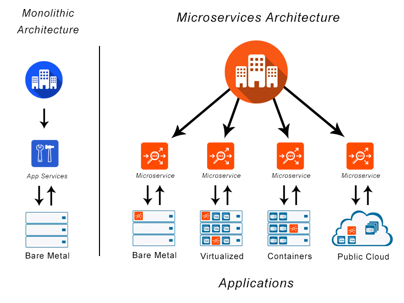
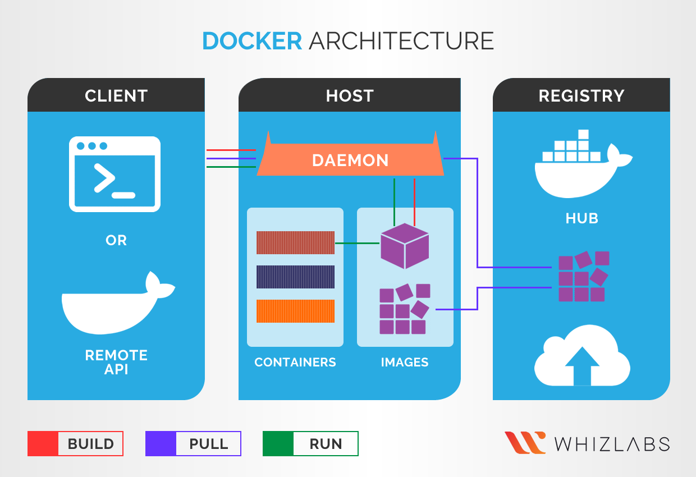

# Microservices
## What is a Microservices Architecture - what are the use cases

This is an approach to software development whereby software is made up of small, independent services that communicate with each other (over APIs). So, an application is divided into multiple individual services, each responsible for a specific business capability.

Containers are a great example of a MSA as they enable businesses to focus on makinging services without having to worry about dependencies. 

Benefits:

- Modularity and scalability: Breaks the application into smaller, independent parts that can be developed and scaled individually.
- Loose coupling: Services operate independently, allowing updates or replacements without affecting other services.
- Technology diversity: Different services can use different technologies based on their specific needs.
- Fault isolation and resilience: Failures in one service do not affect others, improving system resilience.
- Independent deployment: Services can be deployed separately, enabling faster updates and continuous delivery.
- Scalability and performance optimization: Allows fine-grained scaling of services based on demand, improving performance.
- Domain-driven design: Each service focuses on a specific business capability, making the system easier to understand and maintain.
-

However, using microservices requires careful consideration and management due to added complexity.

## Examples of organisations who have implemented a microservice architecture:
1. Netflix: it has a highly distributed system where each component, such as video streaming, recommendation engine, user management, and billing, is handled by separate microservices.

2. Amazon: Amazon utilises  microservices architecture in its e-commerce platform. Services like product catalog, payment processing, order management, and customer reviews are handled by separate microservices, allowing independent development and scalability.

3. Spotify: The music streaming platform uses microservices architecture to support various features, including user authentication, music recommendation, playlist management, and content delivery. Microservices enable agility and scalability as Spotify continues to grow.

## When to not use a Microservices Architecture

Each project and any requirements should be carefuly considered when deciding whether to adopt a microservices architecture. Some reason not to adopt this may be:

- Small-scale projects: For small applications with limited complexity and resource constraints, microservices can introduce unnecessary overhead and complexity

- Tight deadlines: If there is a pressing time constraint and limited resources, the additional complexity of microservices may hinder rapid development and deployment.
.
- Simple and monolithic applications: Applications with straightforward functionality that do not require independent scalability or frequent updates may not benefit significantly from microservices.

- Tight integration requirements: If an application heavily relies on tight integration between components or requires shared state management, a monolithic architecture may be more appropriate.

- Cost considerations: Microservices can require additional infrastructure, deployment, and monitoring resources. If the cost implications outweigh the potential benefits, an alternative architecture may be more suitable.

## Microservices Architecture VS Monolith VS 2tier

These are all architectural styles that have certain characteristics:

**Microservices Architecture**
- Applications are split into small, loosley coupled, and independently deployable services
- Each service represents a specific business capability (and you can develop, deploy, and scale them)
- All the services communicate using APIs
- Suitable for complex applications with many business capabilities and high scallability requirments

**Monolith Architecture**
- Traditional approach where a whole application is built on one, self-contained unit
- Deployed as a single unit and ften rely on a shared database for data storage
- Scaling and updating application is difficult as you would have to rebuild and redeploy the whole application
They are simpler to develop and deploy initially (when application is not big in size and not as complex)

**2-Tier Architecture**
- Has 2 layers: a client layer (user interface) and a server layer (e.g. for data storage). In sparta, I created one layer for the app and another for the database, for example. 
- These two layers interact; the client layer is able to retrieve data and perform operations 
- Usually used for simple applications with a small user base and low complexity. It could become difficukt to manage if the aplication grows 

## Docker

This is an open source platform that lets you create, deploy, and manage software applications in isolated containers. 

1. Containerisation: Applications can be packaged into containers. These containers are lightweight, portable, and self-sufficient. They encapsulate the application and it's dependencies, meaning that you can acheive consistency across different environments. Conatiners live in container repository 

2. Portability - The containers are able to run on any platform/ infrastructure that supports Docker

3. Resource efficiency - The containers share the host system's resources. This helps with efficient utilisation and can run multiply containers on the same machine

4. Isolation and consistency - Docker provises isolation from underlying infrastructure/ other containers, helping applications to run consistently

5. Dependency management: Docker simplifies deployment by managing application dependencies within containers, reducing compatibility issues.

6. Scalability: Docker enables horizontal scaling by running multiple instances of containers to handle increased workloads.

7. Version control and collaboration: Docker supports versioning, facilitating change tracking and collaboration among developers.

### How Docker has been used in the industry

1. To deploy applications: Companies such as Netflix, spotify and Uber, have used Docker as it simplifies the deployment and management of applications in a microservices architecture. It is used to package and deploy microservices allowing for scalability, flexibility, and easy updates. 

2. CI/CD:  Docker can be used in continuous intergration and continuous deployment pipelines to build, test and deploy applications. For example, Jenkins uses Docker containers to make reproducible and isolated build and test environments. 

3. DevOps and Infrastructure as code: ools like Kubernetes, Docker Swarm, and AWS ECS (Elastic Container Service) use Docker to manage and orchestrate containers at scale.

4. Cloud migration and hybrid cloud: Docker simplifies the migration of applications to the cloud and facilitates the adoption of hybrid cloud strategies. Companies like PayPal and eBay have leveraged Docker to modernize their infrastructure, improve scalability, and enable portability between on-premises and cloud environments.

## Setting up Docker

1. Install docker using: https://docs.docker.com/desktop/install/windows-install/

2. Restart your machine and follow this: https://learn.microsoft.com/en-us/windows/wsl/install-manual#step-4---download-the-linux-kernel-update-package

3. In a terminal, enter 'docker --version' to check the version and installation has worked
